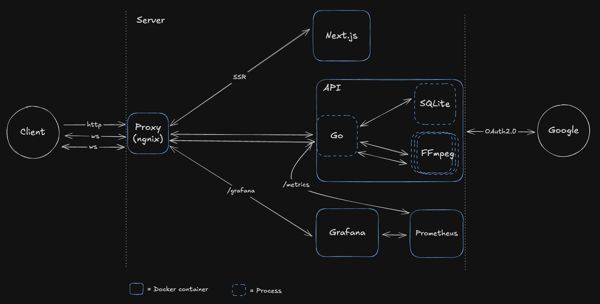
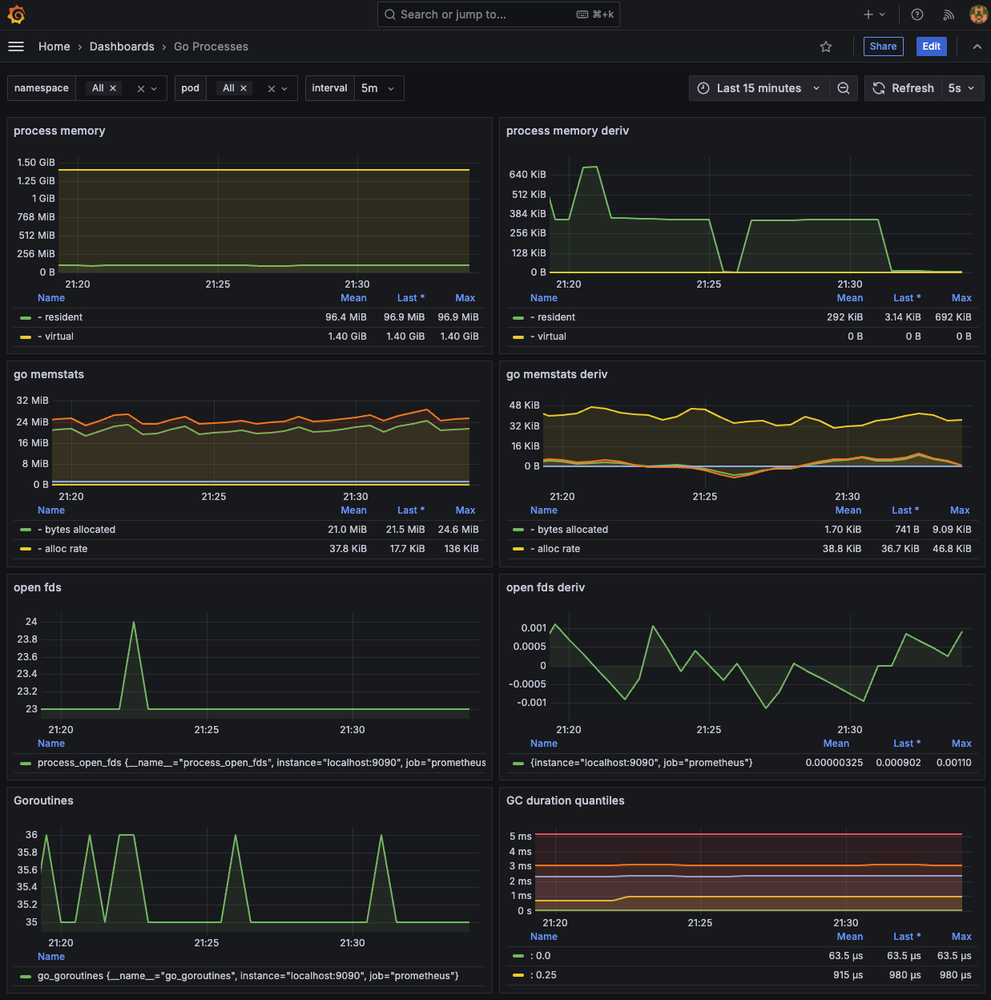

# Screw

A little project with `Go`, `Next.js`, `0Auth2.0`, `DB Sessions`, `Nginx`, `SQLite`, `WebSocket`, `FFmpeg`, `Docker`, and `Docker Compose`.

The audio streams to a `Go` `API` via `WebSocket` connections, where `FFmpeg` processes each stream in real-time (slowed + reverb). The processed audio is returned through the same connections and buffered client-side, where it's rendered as a waveform.

> [!NOTE]
> This is a learning project. Not a production service.

## Features

- Concurrent processing of up to `5` audio files.
- Real-time slowed + reverb audio processing using `FFmpeg`.
- Waveform visualization with `wavesurfer.js`.
- Google `OAuth2.0` authentication with `PKCE`
- Performance monitoring via `Grafana`

## Overview



## How it works

From the client you can select up to `5` audio files. For each selected file a new `WebSocket` connection gets created. The `Go` `API` hanldes them concurrenlty. And spawns a new `FFmpeg` process for each. The data flows from the client, through the `API`, trhough `FFmpeg` `stdin`, and gets sent right back from `stdout` to the `WebSocket`. In the clinet the data gets buffered in a `Blob`. Then a new `URL` gets created for that `Blob`. The waveform and playback are enabled by `wavesurfer.js`.

The convolution reverb is created by using the `Impule Response` in `api/audio/ir.wav`.

### OAuth2.0

The authentication is implemented using Google's `OAuth2.0` with `PKCE` flow, based on Pilcrow's excellent blog posts. This project adapts and expands his `Next.js` example into `Go`.

While there's an official `Go` `OAuth2.0` package available, I decided not to use it for this project.

Key components:

- Custom `PKCE` code challenge generation.
- `State` parameter validation.
- Session management using `SQLite`.
- Token refresh handling.

## Prerequisites

- `Docker` and `Docker Compose`
- Google `OAuth2.0` credentials (optional).

## Setup

1. Clone the repository
2. Copy the example env file:

   ```bash
   cp .env.example .env
   ```

3. Configure your `OAuth2.0` credentials in `.env` (optional).
4. Start the application:

   ```bash
   make dev
   ```

## Grafana

To see Grafana:

1. Go to `localhost:8080/grafana`.
2. Log in with `admin` `admin`.
3. Create `password`.
4. Click on the burger menu on the left. Click `Connections` > `Data Sources` > `+ Add new data sources`.
5. Click `Prometheus` from the list.
6. Set `http://prometheus:9090` in the `Connection` input.
7. Click `Save & test`.
8. Click on the burger menu again > `Dashboards` > `New` > `Import`.
9. Copy the contents of the file at the root of the repo named: `go-process-grafana-dashboard.json`. Click `Load`. Paste.
10. Select `prometheus` as the data source.

You should see this:



### Dashboard credits

You can check the original dashboard [here](https://grafana.com/grafana/dashboards/6671-go-processes/).
