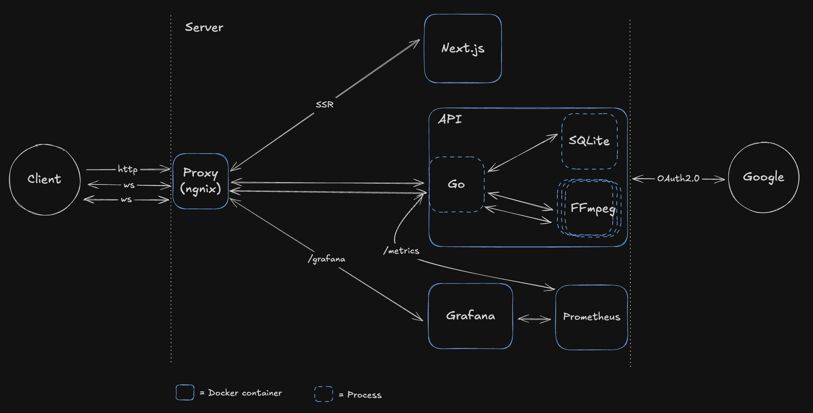
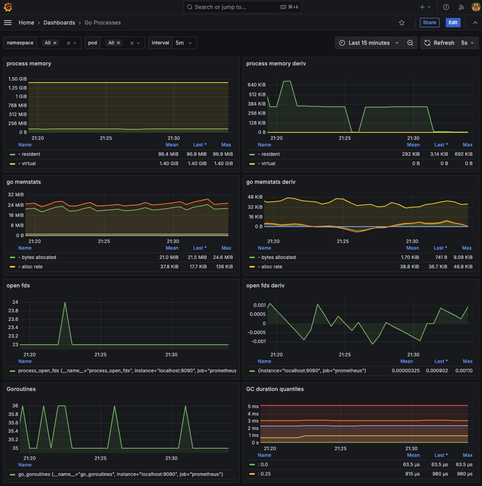

# Screw

A little project with [`Go`](https://go.dev/), [`Next.js`](https://nextjs.org/), [`0Auth2.0`](https://datatracker.ietf.org/doc/html/rfc6749), [`Nginx`](https://nginx.org/), [`SQLite`](https://sqlite.org/), [`WebSocket`](https://developer.mozilla.org/en-US/docs/Web/API/WebSocket), [`FFmpeg`](https://www.ffmpeg.org/), [`Docker`](https://www.docker.com/),[`Grafana`](https://grafana.com/) and [`Prometheus`](https://prometheus.io/)

The audio streams to a `Go` `API` via `WebSocket` connections, where `FFmpeg` processes each stream in real-time. The processed audio is returned through the same connections and buffered client-side, where it's rendered as a waveform.

[About `screw` (Slowed + Reverb)](https://en.wikipedia.org/wiki/Chopped_and_screwed#Slowed_and_reverb)

> [!NOTE]
> This is a learning project. Not a production service.

## Features

- Concurrent processing of up to `5` audio files.
- Real-time slowed + reverb audio processing using `FFmpeg`.
- In memory rate limiting.
- Middleware.
- Google `OAuth2.0` authentication with `PKCE`
- Database sessions.
- Performance monitoring via `Grafana`

## Overview



## Demo

## Client

https://github.com/user-attachments/assets/d834d963-7287-4f32-8dd0-a3527dfc27bc

### Audio example

Beat produced by me in `2020`.

#### Before

https://github.com/user-attachments/assets/b48dc2ef-3bf1-49f7-93ee-2407e95f2413

#### After

https://github.com/user-attachments/assets/6007d385-64de-4623-8125-c2dbb9e80ec0

## How it works

From the client you can select audio files. For each selected file a new `WebSocket` connection gets created. The `Go` `API` handles them concurrently. And spawns a new `FFmpeg` process for each. The data flows from the client, through the `API`, through `FFmpeg` `stdin`, and gets sent back from `stdout` to the `WebSocket`. In the client the data gets buffered in a `Blob`. Then a new `URL` gets created for it. The waveform and playback are enabled by [`wavesurfer.js`](https://wavesurfer.xyz/).

The convolution reverb is created by using the impulse response in `api/audio/ir.wav`.

### OAuth2.0

The authentication is implemented using Google's `OAuth2.0` with `PKCE` flow, based on [Pilcrow's](https://github.com/pilcrowonpaper) [excellent](https://pilcrowonpaper.com/blog/oauth-guide/) [blog](https://pilcrowonpaper.com/blog/how-i-would-do-auth/) [posts](https://lucia-auth.com/). This project adapts and expands his [`Next.js` example](https://github.com/lucia-auth/example-nextjs-google-oauth) into `Go`.

While there's an [official `Go` `OAuth2.0` package](https://pkg.go.dev/golang.org/x/oauth2) available, I decided not to use it for this project.

Key components:

- Custom `PKCE` code challenge generation.
- `State` parameter validation.
- Session management using `SQLite`.
- Token refresh handling.

## How to run

> [!NOTE]
> At one point this project was deployed to `AWS` with a `GitHub Actions` pipeline. That's why you'll find `HCL` code in [`/terraform`](/terraform) and `CI/CD` workflow in [`.github/workflows`](.github/workflows/main.yaml.disabled). I'm no longer running it to avoid costs. If you want to deploy this, you'll need to adapt the configuration for your use case. To try it out locally, follow the instructions below.

### Prerequisites

- `Docker` and `Docker Compose`.
- Google `OAuth2.0` credentials (optional).

### Setup

1. Clone the repository.
2. Copy the example env file:

   ```bash
   cp .env.example .env
   ```

3. Configure your `OAuth2.0` credentials in `.env` (optional).
4. Start the application:

   ```bash
   make dev
   ```

5. Go to `localhost:8080`

## Grafana

To setup the dashboard:

1. Go to `localhost:8080/grafana`.
2. Log in with default credentials:
   - Username: `admin`
   - Password: `admin`
3. Create a new `password`.
4. Click on the burger menu on the left. Click `Connections` > `Data Sources` > `+ Add new data sources`.
5. Click `Prometheus` from the list.
6. Set `http://prometheus:9090` in the `Connection` input.
7. Click `Save & test`.
8. Click on the burger menu again > `Dashboards` > `New` > `Import`.
9. Copy the contents of the file at the root of the repo named: `go-process-grafana-dashboard.json`. Click `Load`. Paste.
10. Select `prometheus` as the data source.

You should see this:



### Dashboard credits

You can check the original dashboard [here](https://grafana.com/grafana/dashboards/6671-go-processes/).
